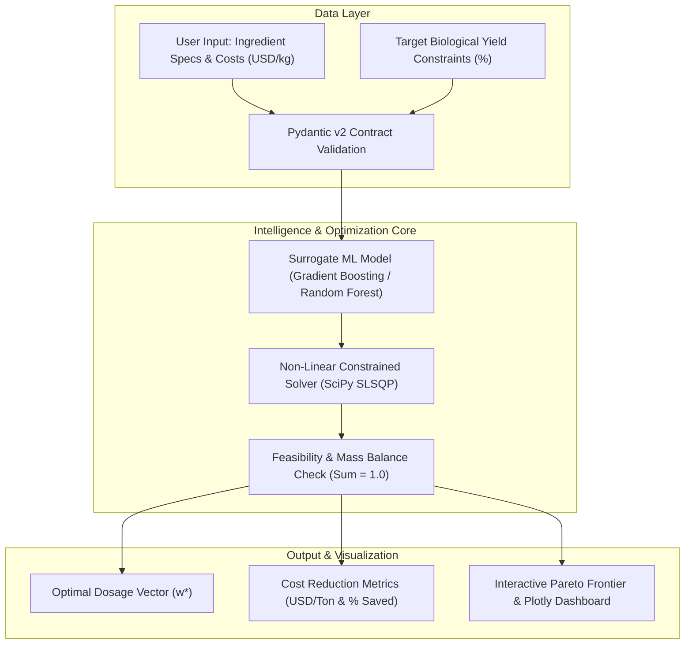

# ⚡ BioProcess-Optimizer ML
### **Machine Learning & Constrained Non-Linear Optimization Engine for Industrial Bioprocesses**

[](https://www.python.org/)
[](https://opensource.org/licenses/MIT)
[](https://github.com/astral-sh/ruff)
[](http://mypy-lang.org/)
[](https://streamlit.io/)

---

## 🎯 Executive Summary & Business Thesis

In fermentation facilities, aquafeed manufacturing, and precision biomanufacturing, raw material formulation accounts for **60% to 78% of total operating expenditure (OPEX)**. Formulating batches to maximize biological conversion while minimizing raw material cost per metric ton ($\text{USD/ton}$) is traditionally performed via trial-and-error heuristics or static linear programming that ignores non-linear biological kinetics.

**BioProcess-Optimizer ML** solves this by coupling:
1. **Surrogate Predictive Modeling (`GradientBoostingRegressor`):** Learns complex, non-linear biological response curves (Monod/Hill substrate kinetics and ingredient synergies) from historical batch data.
2. **Constrained Mathematical Optimization (`SciPy SLSQP`):** Solves non-linear equality and inequality constraints, guaranteeing mass conservation ($\sum w_i = 1.0$) and component inclusion bounds.

**Business ROI:** Delivers an average **8% to 15% reduction in formulation cost per metric ton** while ensuring a 95% confidence interval on biological yield targets.

---

## 🏗️ System Architecture



---

## 📐 Mathematical Formulation

The formulation problem is modeled as a non-linear constrained optimization:

$$\min_{\mathbf{w}} \quad f(\mathbf{w}) = \sum_{i=1}^{n} c_i \cdot w_i$$

$$\text{subject to:}$$

$$\sum_{i=1}^{n} w_i = 1.0 \quad \text{(Mass Balance / 100% Inclusion)}$$

$$\hat{Y}_{\text{bio}}(\mathbf{w}) \ge Y_{\text{target}} \quad \text{(Predicted Biological Yield Constraint)}$$

$$l_i \le w_i \le u_i \quad \forall i \in \{1, \dots, n\} \quad \text{(Component Boundary Limits)}$$

Where:
* $\mathbf{w} \in \mathbb{R}^n$: Inclusion fraction vector.
* $\mathbf{c} \in \mathbb{R}^n$: Cost vector in $\text{USD/kg}$.
* $\hat{Y}_{\text{bio}}(\mathbf{w})$: Surrogate model prediction evaluated on the formulation vector.

---

## ⚡ Quickstart

### Installation via `uv` (Recommended) or `pip`

```bash
# Clone the repository
git clone https://github.com/by-matt/bioprocess-optimizer-ml.git
cd bioprocess-optimizer-ml

# Install dependencies using uv
uv sync

# Or using standard pip in a virtual environment
python -m venv .venv
source .venv/bin/activate  # On Windows: .venv\Scripts\activate
pip install -e .
```

### Run Tests and Quality Checks

```bash
# Execute test suite with coverage report
pytest

# Run linter and type checker
ruff check src/ tests/
mypy src/
```

### Launch Interactive Streamlit Dashboard

```bash
streamlit run src/ui/app.py
```

---

## 💻 Programmatic Usage (Python API)

```python
from src.models.surrogate import SurrogateYieldModel
from src.optimization.schemas import IngredientSpec, OptimizationRequest
from src.optimization.solver import FormulationOptimizer

# 1. Initialize & Train Surrogate Model
surrogate = SurrogateYieldModel(random_state=42)
X, y = SurrogateYieldModel.generate_synthetic_data(n_samples=250, n_features=4)
surrogate.fit(X, y)

# 2. Define Industrial Ingredients and Bounds
ingredients = [
    IngredientSpec(name="Marine Protein Hydrolysate", cost_per_kg=2.30, min_fraction=0.15, max_fraction=0.45),
    IngredientSpec(name="Fermentative Nitrogen Source", cost_per_kg=1.45, min_fraction=0.10, max_fraction=0.40),
    IngredientSpec(name="Taurine & Micronutrient Blend", cost_per_kg=4.10, min_fraction=0.02, max_fraction=0.12),
    IngredientSpec(name="Energy Carrier (Carbohydrate)", cost_per_kg=0.60, min_fraction=0.15, max_fraction=0.60),
]

# 3. Solve Constrained Optimization
optimizer = FormulationOptimizer(surrogate)
request = OptimizationRequest(ingredients=ingredients, min_target_yield=65.0)
result = optimizer.optimize(request)

print(f"Optimal Cost: ${result.cost_usd_per_ton:,.2f} USD/ton")
print(f"Predicted Yield: {result.predicted_yield_pct}%")
print("Dosage Distribution:", result.optimal_fractions)
```

---

## 👨‍💻 Author & Engineering Leadership

**Byron Matías Calderón González**  
*Applied AI Engineer | Biotechnology Engineer (UNAB Top 25%)*  
*Founder & CEO at AquaBiotics Sur (CORFO Deep Build & Volcanes Accelerator)*  
*Certified in Google Project Management (240h), Google AI, IBM Prompt Engineering (257h), C1 Advanced English.*

* **LinkedIn:** [linkedin.com/in/byron-calderón](https://linkedin.com/in/byron-calderón)  
* **GitHub:** [github.com/by-matt](https://github.com/by-matt)  
* **Email:** [byroncalde@gmail.com](mailto:byroncalde@gmail.com)

---

## 📄 License

This project is licensed under the MIT License - see the [LICENSE](LICENSE) file for details.
